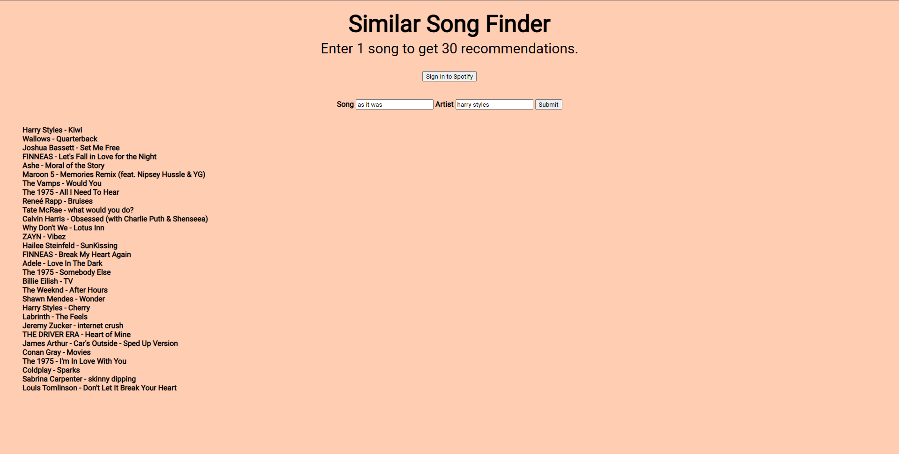

# similar-song-finder
https://matthewperrywa.github.io/similar-song-finder/

Website that gives 30 song recommendations based on 1 entered song.

Utilizes Spotify Web API to find the entered track and recommend 30 similar songs in the Spotify database.

*This website is in development mode. Spotify has restrictions on the ability to access apps that are in development mode. This means that this website will be unusable unless you have developer access.

